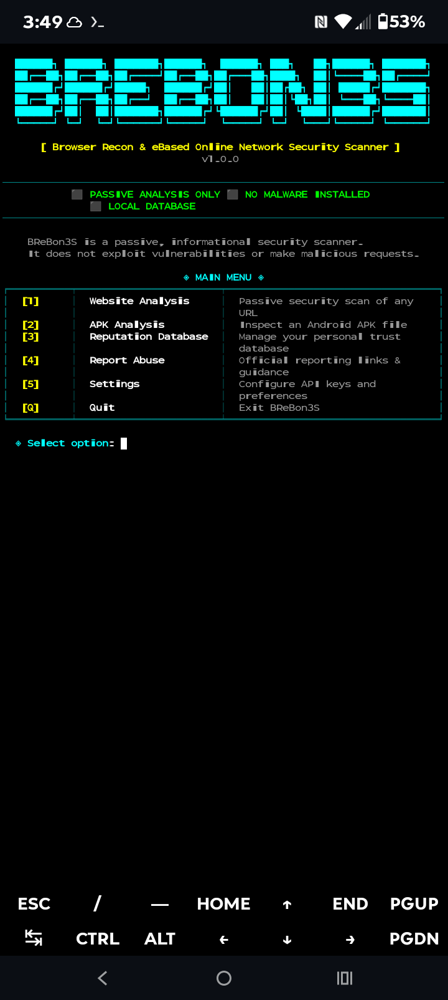

# 🔵 BReBon3S

## Browser Recon & eBased Online Network Security Scanner

<p align="center">
  
</p>

<p align="center">
  <b>Passive Security Analysis • No Root Required • No Exploitation</b>
</p>

---

```
██████╗ ██████╗ ███████╗██████╗  ██████╗ ███╗   ██╗██████╗ ███████╗
██╔══██╗██╔══██╗██╔════╝██╔══██╗██╔═══██╗████╗  ██║╚════██╗██╔════╝
██████╔╝██████╔╝█████╗  ██████╔╝██║   ██║██╔██╗ ██║ █████╔╝███████╗
██╔══██╗██╔══██╗██╔══╝  ██╔══██╗██║   ██║██║╚██╗██║ ╚═══██╗╚════██║
██████╔╝██║  ██║███████╗██████╔╝╚██████╔╝██║ ╚████║██████╔╝███████║
╚═════╝ ╚═╝  ╚═╝╚══════╝╚═════╝  ╚═════╝ ╚═╝  ╚═══╝╚═════╝ ╚══════╝
```

> **Version 1.0.0**  
> Passive analysis only • No root required • No exploitation

---

# 📖 About BReBon3S

**BReBon3S (Browser Recon & eBased Online Network Security Scanner)** is an open-source passive security analysis tool designed to help users inspect websites and Android APK files for suspicious indicators.

BReBon3S is built for terminal environments, especially **Termux on Android**.

The goal of BReBon3S is to provide security information without performing intrusive actions.

---

# ⚠️ What BReBon3S Is NOT

BReBon3S is **not**:

- ❌ A vulnerability scanner
- ❌ A penetration testing framework
- ❌ An antivirus replacement
- ❌ A guaranteed malware detector
- ❌ An exploitation tool
- ❌ An automatic reporting system

---

# ✅ Features

## 🌐 Website Analysis

- Website reputation checks
- Domain information gathering
- Security observation tracking
- Local reputation storage

## 📱 APK Analysis

- APK information extraction
- Package inspection
- Suspicious indicator checking
- No root required

## 🗄️ Reputation Database

- Store website results
- Store APK results
- Maintain local security records
- Review previous checks

## 📝 Reporting Resources

Provides guidance toward official reporting channels for suspicious websites and applications.

---

# ⚡ Quick Start — Termux

## 1. Install Requirements

```bash
pkg update -y && pkg upgrade -y

pkg install -y python git clang libxml2 libxslt openssl libffi unzip
```

---

## 2. Clone Repository

```bash
git clone https://github.com/Ren23447/BReBon3S.git
```

---

## 3. Enter Directory

```bash
cd BReBon3S
```

---

## 4. Install BReBon3S

```bash
chmod +x termux-install.sh

./termux-install.sh
```

---

## 5. Run

```bash
python3 main.py
```

---

# 📱 Termux Requirements

| Package | Purpose |
|---|---|
| Python | Runs BReBon3S |
| Git | Downloads updates |
| Clang | Builds required packages |
| Libxml2 | XML support |
| Libxslt | XSLT support |
| OpenSSL | Secure connections |
| Libffi | Cryptography support |
| Unzip | Archive extraction |

---

# 🔄 Updating

From inside the BReBon3S folder:

```bash
git pull
```

Update dependencies:

```bash
pip install -r requirements.txt
```

Run:

```bash
python3 main.py
```

---

# 📂 Project Structure

```
BReBon3S/
│
├── main.py
├── website.py
├── apk.py
├── database.py
├── reporting.py
├── settings.py
├── utils.py
├── requirements.txt
├── termux-install.sh
├── install.sh
│
└── Screenshot_20260722-154936_Termux.png
```

---

# 🔐 Security Philosophy

BReBon3S follows a passive security approach:

- No exploitation
- No unauthorized access
- No attacks
- No automated malicious actions

The tool is designed to help users make safer decisions.

---

# 🚀 Future Improvements

Planned improvements may include:

- Better website reputation checks
- Expanded APK analysis
- Improved terminal interface
- More security data sources
- More reporting resources

---

# 🤝 Contributing

Contributions and suggestions are welcome.

Please keep contributions:

- Safe
- Ethical
- Documented
- Focused on improving security awareness

---

# 📜 License

This project is open-source and licensed under the included LICENSE file.

---

# ⚠️ Disclaimer

BReBon3S provides security information and analysis only.

Results should not be considered guaranteed proof that a website, application, or file is safe or malicious.

Always verify important security decisions using trusted security resources.
./termux-install.sh
```

Run:

```bash
python3 main.py
```

---

# 📱 Termux Installation Requirements

| Package | Purpose |
|---|---|
| Python | Runs BReBon3S |
| Git | Downloads and updates project |
| Clang | Compiles required packages |
| Libxml2 | XML processing support |
| Libxslt | XSLT processing support |
| OpenSSL | Secure connections |
| Libffi | Cryptography support |
| Unzip | Extracting archives |

---

# 🔄 Updating BReBon3S

Inside the BReBon3S folder:

```bash
git pull
```

Update dependencies:

```bash
pip install -r requirements.txt
```

Run:

```bash
python3 main.py
```

---

# 📂 Project Structure

```
BReBon3S/
│
├── main.py
├── website.py
├── apk.py
├── database.py
├── reporting.py
├── settings.py
├── utils.py
├── requirements.txt
├── termux-install.sh
│
└── assets/
    └── Screenshot_20260722-154936_Termux.png
```

---

# 🛡️ Safety Disclaimer

BReBon3S provides security information and analysis.

Results should be treated as indicators and not absolute proof that a website or application is safe or malicious.

Always verify important security decisions using trusted security resources.

---

# 📜 License

Open-source project licensed under the included LICENSE file.
